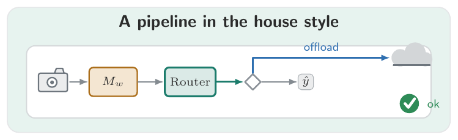
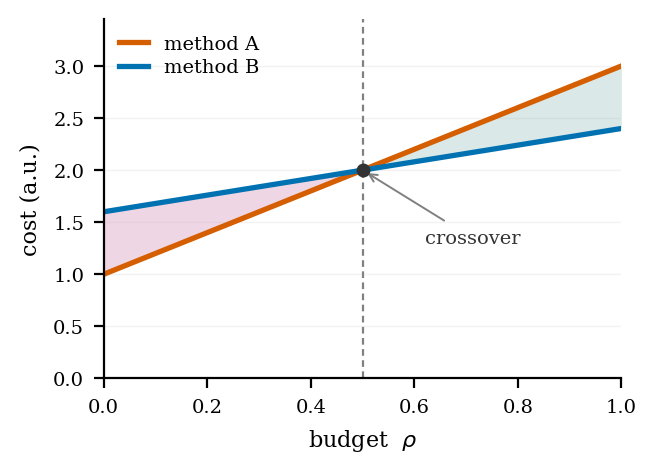

# wgstyle — Wei Geng's figure style kit

One palette, one set of conventions, shared across every paper. The point
is that diagrams (TikZ) and plots (matplotlib) look like they came from the
same hand, and stay consistent even as papers come and go.

## The one idea: two layers

| Layer | What it fixes | Where it lives | You edit it… |
|---|---|---|---|
| **Appearance** (global) | hues, fonts, line weights, arrowheads, shapes, icons | this `figstyle/` kit | once, upstream |
| **Meaning** (per-paper) | which concept = which hue; column widths | `theme.tex` / `theme.py` in each paper | per paper |

**Golden rule: figures address colors by *meaning*, never by hue.** A figure
says `draw=ours` or `color=T.OURS`, never `wgTeal`. That one discipline is
what lets a palette change reflow every paper, and a per-paper remap be a
single line — without touching any figure.

## Files

```
figstyle/
  palette.toml      # SINGLE SOURCE OF TRUTH — edit this, then run gen.py
  gen.py            # palette.toml -> the three generated files below
  wgpalette.tex     # (generated) \definecolor block
  wgpalette.py      # (generated) color constants + widths + use_style()
  wgeng.mplstyle    # (generated) shared matplotlib rcParams
  wgstyle.sty       # LaTeX package: tikz styles + icon library (neutral)
  theme.tex         # TEMPLATE per-paper semantic map  (copy + edit)
  theme.py          # TEMPLATE per-paper semantic map  (copy + edit)
  examples/         # worked demos (build to PDF)
```

## Quick start

**Vendor** the kit into a paper (self-contained, so arXiv/Overleaf/co-authors
all build): copy this `figstyle/` folder to the project root and copy
`theme.tex` / `theme.py` next to your sources, then edit the bindings.

**LaTeX** (in the preamble, appearance then meaning):
```latex
\usepackage{figstyle/wgstyle}
\input{theme}
```
Then in a figure, give neutral shapes meaning with a color override:
```latex
\begin{tikzpicture}[wgfig]
  \node[wgbox, draw=ours, fill=ours!16] {Router};
  \draw[wgflow, draw=cost] (a) -- (b);
  \pic at (0,0) {camera};
\end{tikzpicture}
```

**matplotlib** (`theme.py` sits in your `figs/` folder):
```python
import os, sys
sys.path.insert(0, os.path.dirname(os.path.abspath(__file__)))
import theme as T                      # applies wgeng.mplstyle on import
fig, ax = plt.subplots(figsize=(T.COL, T.COL * 0.7))
ax.plot(x, y, color=T.OURS)
```

## The palette

Okabe-Ito / Wong derived — colorblind-safe and grayscale-distinguishable.
Each core hue `wg<Name>` has a light tint `wg<Name>Bg` (Python: `NAME`,
`NAME_BG`).

| Concept default | LaTeX | Python | Typical meaning |
|---|---|---|---|
| primary | `wgTeal` | `wg.TEAL` | ours / method / hero |
| secondary | `wgBlue` | `wg.BLUE` | infrastructure / control |
| attention | `wgAmber` | `wg.AMBER` | the costly thing |
| neutral | `wgSlate` | `wg.SLATE` | pipeline / generic |
| good | `wgGreen` | `wg.GREEN` | health / fixes / ideal |
| bad | `wgRed` | `wg.RED` | problem / drift / failure |
| alt | `wgPurple`, `wgPink` | `wg.PURPLE`, `wg.PINK` | extra categories |
| line accents | `wgVivid`, `wgAzure` | `wg.VIVID`, `wg.AZURE` | two max-contrast curves |

### Changing the palette

Edit `palette.toml`, then:
```bash
python gen.py        # rewrites wgpalette.tex, wgpalette.py, wgeng.mplstyle
```
Never edit the generated files by hand — they carry a "DO NOT EDIT" stamp.

## TikZ reference (`wgstyle.sty`)

Apply `[wgfig]` to the picture for serif font + the house arrowhead. All
node/edge styles are **neutral** (slate); add a color override for meaning.

- **Nodes:** `wgpanel` (faint backdrop — override `fill` with a `*Bg` tint),
  `wgcard` (white card), `wgbox` (labelled box), `wgchip`, `wgpill`,
  `wgdiamond`, `wgleaf`; text: `wghdr`, `wglbl`, `wgtiny`.
- **Edges:** `wgflow`, `wgflowhi`, `wgfan`, `wgbus`, `wgrail`, `wgdep`,
  `wgtap`, `wgbound`.
- **Icons (pics):** `camera`, `cloud`, `chip`, `server`, `gear`, `doc`,
  `envelope`, `check`, `pulse`, `spark`. Use `\pic at (x,y) {camera};`.
  Domain-specific icons belong in your `theme.tex`, not here.

## matplotlib reference

`wgeng.mplstyle` sets: serif 8pt, labels 8 / ticks 7 / legend 7,
`mathtext.fontset dejavuserif` (so `$…$` math renders in the serif body font,
not matplotlib's default sans), no top/right spines, frameless legend,
`lines.linewidth 1.9`, `savefig.bbox tight`, and `pdf.fonttype 42` (no Type-3
fonts — camera-ready safe). Applied automatically when `theme.py` is imported
(it calls `wg.use_style()`).

Idioms baked into the examples: shade a `fill_between` band to *name* a
quantity; mark a turn/crossover point with a dashed `axvline` + scatter +
arrow annotation; always label curves and put the legend frameless.

## Conventions checklist

- Always export figures as **PDF**; keep raw plot data in `figs/data/*.csv`.
- Vary **line style** (solid/dashed/dotted) as well as color, so curves
  survive grayscale printing.
- Every figure carries a legend; name colors/curves in the prose too
  (e.g. "the baseline (\textcolor{bad}{red})").
- Keep captions compact; the body text carries the description.

## Examples

Build: `pdflatex arch_demo.tex` and `python curves_demo.py` inside
`examples/`.




